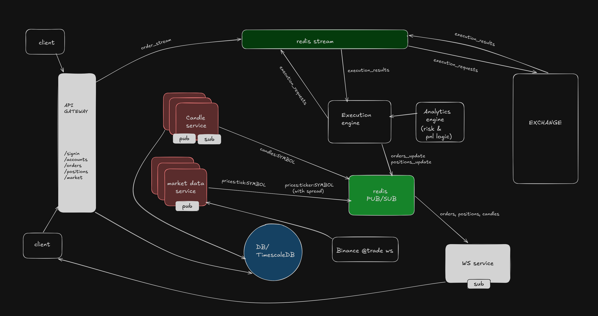

# Exless Trading Platform (Backend)

A production-grade, real-time CFD trading backend built with a microservice architecture. It mimics a modern broker like Exness — supporting leveraged **LONG/SHORT** trading, internal synthetic execution, real-time market streaming, account-type-based spreads and commissions, and full margin/risk management.  
The system uses **Redis Streams** for reliable order processing and **Redis Pub/Sub** for live frontend updates, all running on a shared Turborepo monorepo.

---

## System architecture



# Tech Stack

| Layer               | Technology                                                                      |
| ------------------- | ------------------------------------------------------------------------------- |
| **Language**        | TypeScript                                                                      |
| **Runtime**         | Node.js                                                                         |
| **API Framework**   | Express                                                                         |
| **Database**        | PostgreSQL (with TimescaleDB extension for time-series)                         |
| **Messaging**       | Redis Streams (reliable order pipeline), Redis Pub/Sub (real-time broadcasting) |
| **WebSocket**       | `ws` library – both for Binance ingestion and client push                       |
| **Authentication**  | JWT (JSON Web Tokens) + bcrypt password hashing                                 |
| **Monorepo Tool**   | Turborepo                                                                       |
| **Package Manager** | pnpm                                                                            |

---

# Trading Logic

## LONG Position Profit

```txt
Profit = (closePrice - openPrice) × quantity
```

## SHORT Position Profit

```txt
Profit = (openPrice - closePrice) × quantity
```

## Margin Calculation

```txt
requiredMargin = notionalValue / leverage
notionalValue = executionPrice × quantity
```

### Example

Position size (notional) = $10,000  
Leverage = 1:100

Required Margin:

```txt
$10,000 / 100 = $100
```

---

## Account Fields

| Field         | Meaning                                   |
| ------------- | ----------------------------------------- |
| `balance`     | Realised cash                             |
| `equity`      | `balance + unrealisedPnL`                 |
| `used_margin` | Total margin locked by all open positions |
| `free_margin` | `equity – used_margin`                    |

---

# Redis Usage

## Redis Streams (Reliable, Durable Order Processing)

- **`orders_stream`** – Order Service pushes `{ orderId }`; Execution Engine consumes.
- **`execution_requests`** – Engine sends order details to Internal Exchange.
- **`execution_results`** – Internal Exchange returns fill outcome.
- Consumer groups guarantee that orders are processed exactly once and survive service restarts.

---

## Redis Pub/Sub (Real-Time Broadcasting)

- **`prices:ticker:<SYMBOL>`** – Broker spread-applied ticker (bid/ask/last).
- **`prices:tick:<SYMBOL>`** – Raw trade ticks for candle aggregation.
- **`candles:<SYMBOL>:<interval>`** – Closed candles pushed to chart clients.
- **`orders_updates`** – Order status changes (`FILLED`, `REJECTED`).
- **`position_updates`** – Position changes and real-time unrealised PnL.

---

## Redis Keys (Snapshot Cache)

- **`raw:ticker:<SYMBOL>`** – Minimal-spread market price used by Internal Exchange for trade execution (stored every tick).

---

# Project Structure

```txt
├── apps
│   ├── analytics
│   │   ├── package.json
│   │   ├── src
│   │   │   ├── index.ts
│   │   │   ├── pnlUpdate.ts
│   │   │   └── riskUpdate.ts
│   │   └── tsconfig.json
│   ├── api-gateway
│   │   ├── package.json
│   │   ├── src
│   │   │   ├── index.ts
│   │   │   ├── middleware.ts
│   │   │   ├── routes
│   │   │   │   ├── accounts.ts
│   │   │   │   ├── auth.ts
│   │   │   │   ├── market.ts
│   │   │   │   ├── orders.ts
│   │   │   │   ├── positions.ts
│   │   │   │   └── wallet.ts
│   │   │   └── schema
│   │   │       ├── orderSchema.ts
│   │   │       └── signupSchema.ts
│   │   └── tsconfig.json
│   ├── candle-service
│   │   ├── dist
│   │   │   ├── aggregator.js
│   │   │   ├── apps
│   │   │   │   └── candle-service
│   │   │   │       └── src
│   │   │   │           ├── aggregator.d.ts
│   │   │   │           ├── aggregator.d.ts.map
│   │   │   │           └── aggregator.js
│   │   │   ├── candle-service
│   │   │   │   └── src
│   │   │   │       ├── aggregator.d.ts
│   │   │   │       ├── aggregator.d.ts.map
│   │   │   │       └── aggregator.js
│   │   │   └── packages
│   │   │       ├── db
│   │   │       │   └── src
│   │   │       │       ├── index.d.ts
│   │   │       │       ├── index.d.ts.map
│   │   │       │       └── index.js
│   │   │       └── redis
│   │   │           └── src
│   │   │               ├── index.d.ts
│   │   │               ├── index.d.ts.map
│   │   │               └── index.js
│   │   ├── package.json
│   │   ├── src
│   │   │   ├── aggregator.ts
│   │   │   ├── bootstrap.ts
│   │   │   ├── index.ts
│   │   │   └── tickListener.ts
│   │   └── tsconfig.json
│   ├── execution-engine
│   │   ├── package.json
│   │   ├── src
│   │   │   ├── fillHandler.ts
│   │   │   ├── index.ts
│   │   │   ├── orderExecuter.ts
│   │   │   ├── reconcillation.ts
│   │   │   └── tradeLogic.ts
│   │   └── tsconfig.json
│   ├── internal-exchange
│   │   ├── package.json
│   │   ├── src
│   │   │   ├── executionENgine.ts
│   │   │   └── index.ts
│   │   └── tsconfig.json
│   ├── market-data-service
│   │   ├── package.json
│   │   ├── src
│   │   │   ├── index.ts
│   │   │   └── pricing.ts
│   │   └── tsconfig.json
│   └── ws-service
│       ├── package.json
│       ├── src
│       │   └── index.ts
│       └── tsconfig.json
├── package.json
├── packages
│   ├── config
│   ├── db
│   │   ├── dist
│   │   │   ├── index.d.ts
│   │   │   ├── index.d.ts.map
│   │   │   └── index.js
│   │   ├── package.json
│   │   ├── src
│   │   │   └── index.ts
│   │   └── tsconfig.json
│   ├── eslint-config
│   │   ├── base.js
│   │   ├── next.js
│   │   ├── package.json
│   │   ├── react-internal.js
│   │   └── README.md
│   ├── redis
│   │   ├── dist
│   │   │   ├── index.d.ts
│   │   │   ├── index.d.ts.map
│   │   │   └── index.js
│   │   ├── package.json
│   │   ├── src
│   │   │   ├── index.d.ts
│   │   │   ├── index.d.ts.map
│   │   │   └── index.ts
│   │   └── tsconfig.json
│   ├── types
│   │   ├── package.json
│   │   ├── src
│   │   │   ├── account.ts
│   │   │   ├── market.ts
│   │   │   └── trading.ts
│   │   └── tsconfig.json
│   ├── typescript-config
│   │   ├── base.json
│   │   ├── nextjs.json
│   │   ├── package.json
│   │   └── react-library.json
│   ├── ui
│   │   ├── eslint.config.mjs
│   │   ├── package.json
│   │   ├── src
│   │   │   ├── button.tsx
│   │   │   ├── card.tsx
│   │   │   └── code.tsx
│   │   └── tsconfig.json
│   └── utils
├── pnpm-lock.yaml
├── pnpm-workspace.yaml
├── README.md
```

Each service is independently runnable via `pnpm dev` and communicates only through Redis or REST.

---

# Main Services & Responsibilities

## API Gateway

- Handles `POST /auth/signup`, `POST /auth/signin`
- JWT authentication middleware
- CRUD for accounts
- Market endpoints
- Order placement
- Position fetching
- Wallet management

### Main Endpoints

```http
POST /auth/signup
POST /auth/signin

GET /accounts
POST /accounts

POST /orders
GET /orders

GET /positions

GET /market/ticker/:symbol
GET /market/candles/:symbol

POST /wallet/deposit
POST /wallet/withdraw
GET /wallet/history
```

---

## Market Data Service

- Connects to Binance WebSocket
- Publishes raw ticks (`prices:tick:*`)
- Publishes broker-spread tickers (`prices:ticker:*`)
- Stores raw ticker (`raw:ticker:*`) for execution pricing

---

## Candle Service

- Subscribes to `prices:tick:*`
- Aggregates OHLCV candles
- Stores candles in TimescaleDB
- Publishes closed candles to frontend

---

## Execution Engine

- Consumes `orders_stream`
- Validates margin
- Calculates leverage requirements
- Decides A-book / B-book route
- Sends execution requests
- Updates:
  - orders
  - trades
  - balances
  - positions
  - ledger

Publishes:

- `orders_updates`
- `position_updates`

---

## Internal Exchange

- Simulated exchange execution layer
- Reads market prices from Redis
- Applies:
  - spread
  - slippage
  - commission
- Checks free margin
- Returns execution result

---

## Analytics Service

### PnL Updater

- Subscribes to live ticker updates
- Recalculates unrealised PnL
- Updates:
  - equity
  - free margin

### Risk Engine

Runs periodically and updates:

- win rate
- holding duration
- trade frequency
- user risk score

Used for A-book / B-book routing.

---

## WebSocket Service

- Pushes:
  - live prices
  - candles
  - order updates
  - position updates
- Supports dynamic subscriptions
- Handles frontend real-time sync

---

# Order Lifecycle

```txt
PENDING
   ↓
QUEUED
   ↓
SENT_TO_EXCHANGE
   ↓
ACKNOWLEDGED
   ↓
FILLED / PARTIALLY_FILLED / REJECTED
```

If margin is insufficient:

```txt
Order → REJECTED
```

No funds are locked.

# Running the Project

## Prerequisites

- Node.js
- pnpm
- Redis
- PostgreSQL
- TimescaleDB

---

## Installation

```bash
pnpm install
```

---

## Start Services

```bash
turbo run dev
```

---

## API

```txt
http://localhost:4000
```

---

## WebSocket

```txt
ws://localhost:3001
```

---

# Testing

Use Postman or cURL to:

- Sign up / sign in
- Create demo accounts
- Place leveraged trades
- Watch live PnL updates
- Verify Redis streams
- Verify ledger entries

Useful debugging tools:

```bash
redis-cli
```

```sql
SELECT * FROM orders;
SELECT * FROM positions;
SELECT * FROM ledger;
```

---

# Inspiration

Inspired by modern CFD broker architectures:

- Exness
- IC Markets
- Pepperstone
- Bybit CFD systems

This project demonstrates:

- Event-driven microservices
- Real-time trading systems
- Financial ledger architecture
- Margin and leverage handling
- Broker-style execution pipelines
- Redis stream-based order execution
